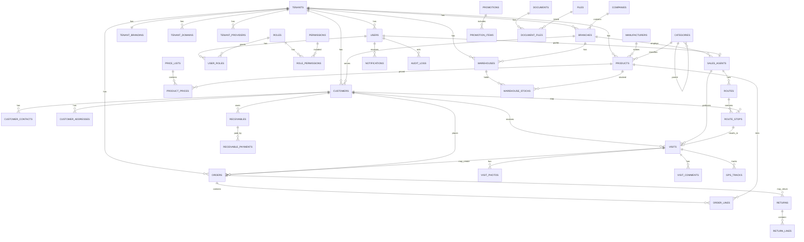
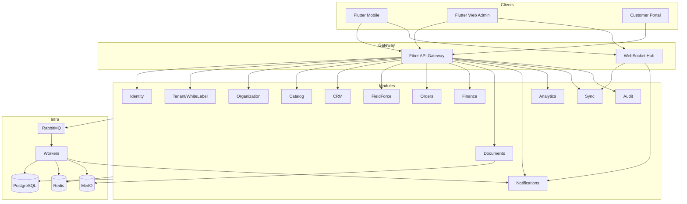
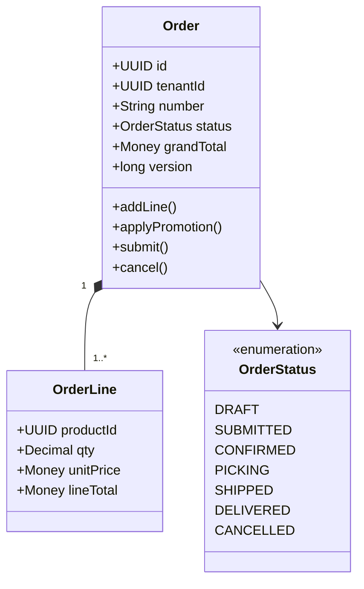
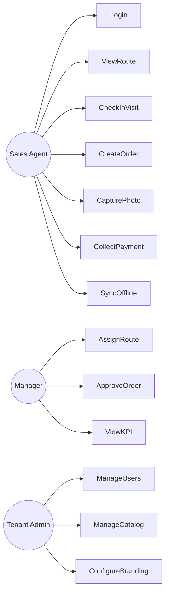
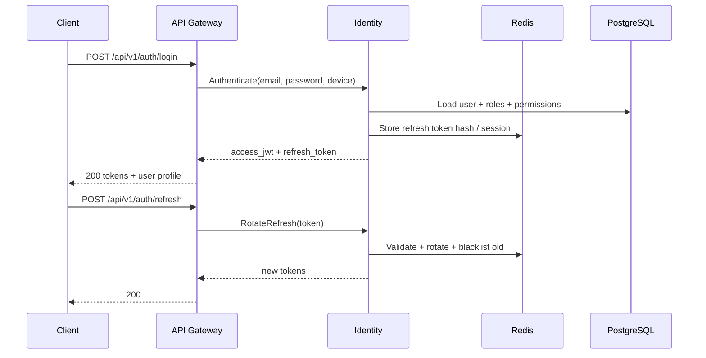
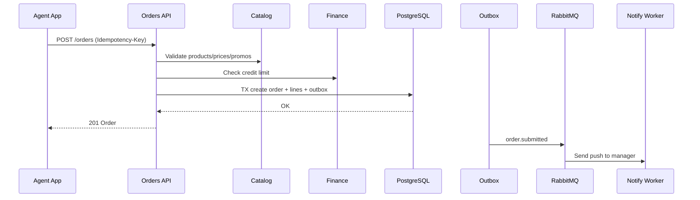
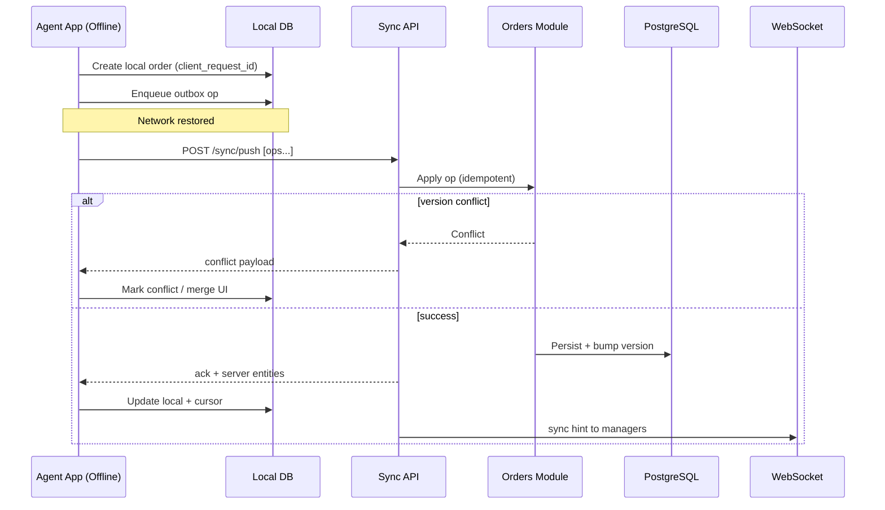
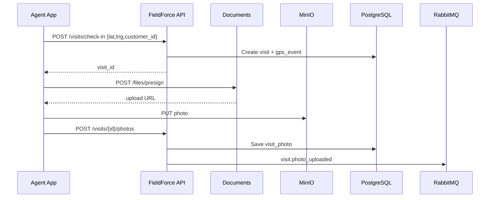
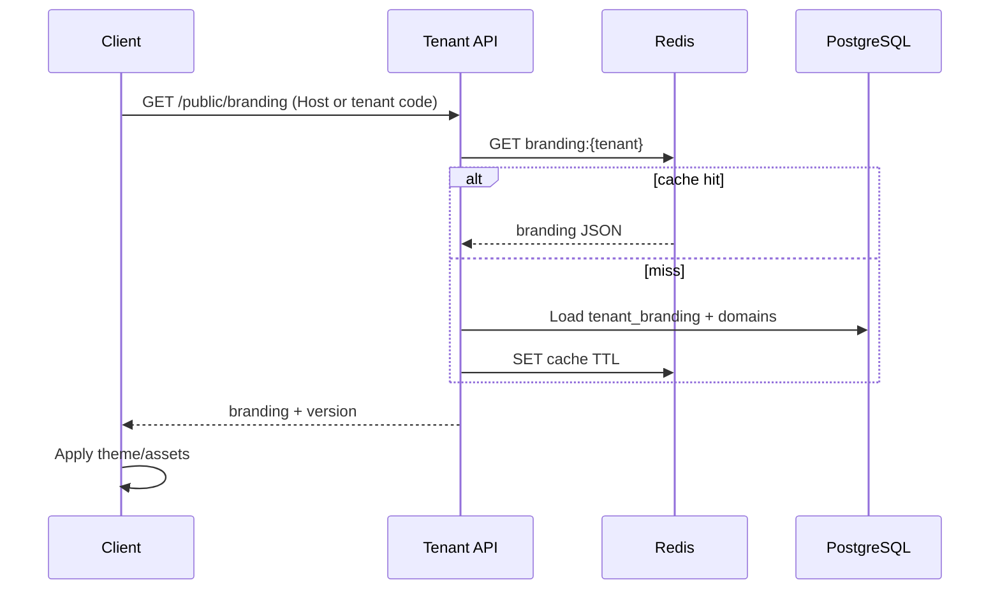

# 6–8. Diagrams (ER / UML / Sequence)

## 6. ER Diagram (Logical)

---

## 7. UML — Component / Package

### UML — Class (Order Aggregate excerpt)

### UML — Use Case (Agent)

---

## 8. Sequence Diagrams

### 8.1 Login + Token Refresh

### 8.2 Create Order (Online)

### 8.3 Offline Order + Sync Push

### 8.4 Visit Check-in with GPS + Photo

### 8.5 White Label Branding Resolve

